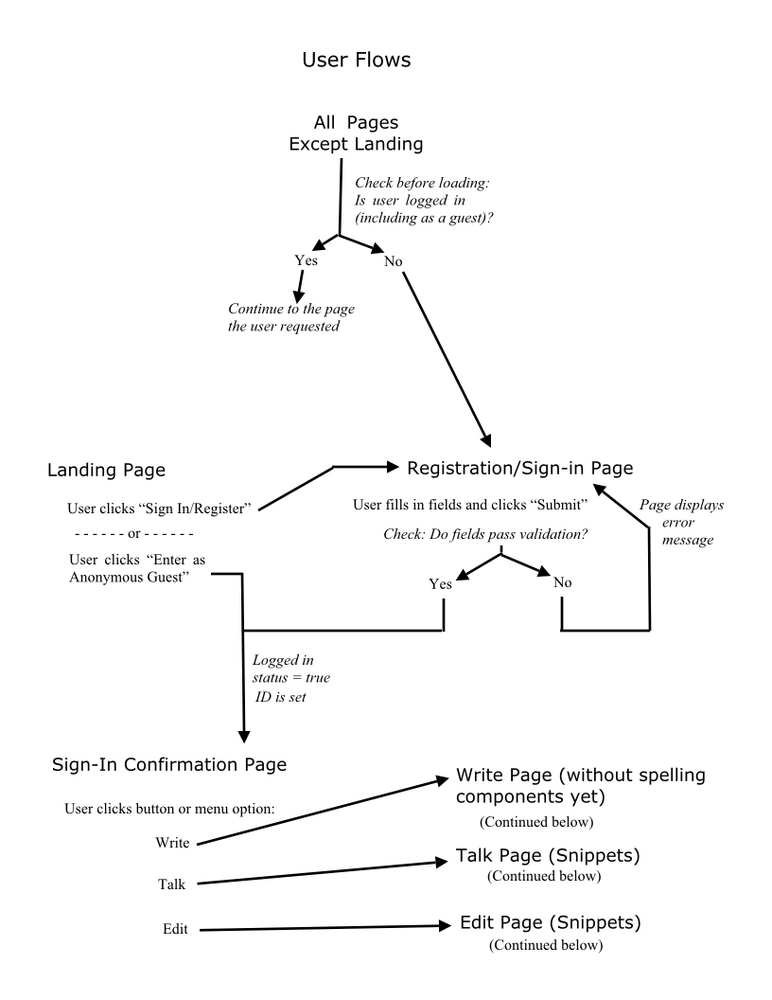
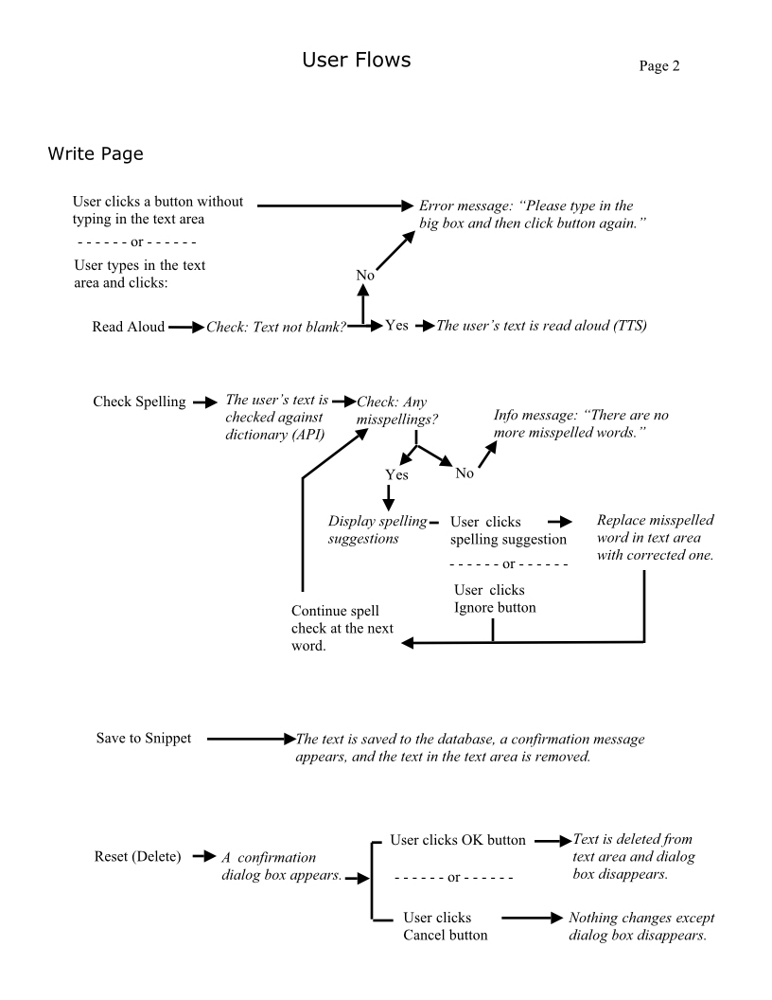
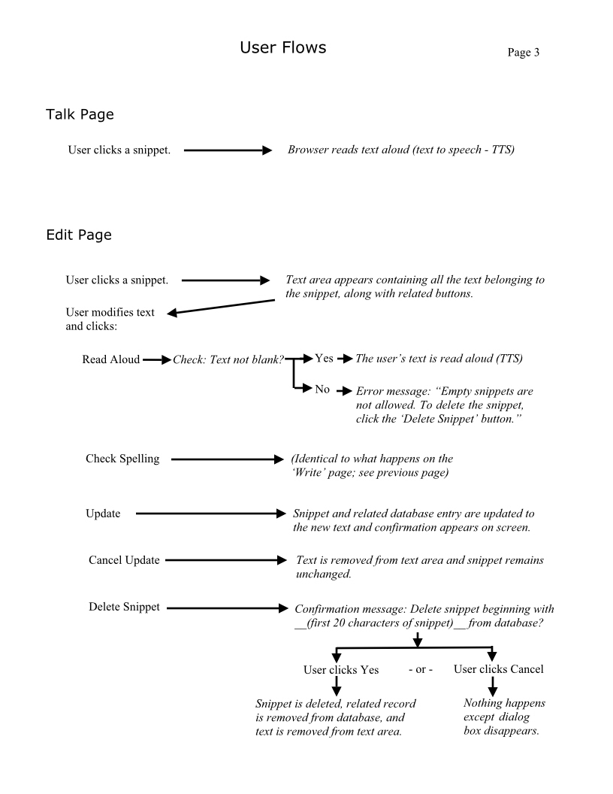

# Write to Speak Demo App

This is an app in progress. So far I have completed screen layouts that are not functional yet, but you can get an idea of what they look like - for mobile devices - with dummy data by going [here](https://write-to-speak-demo.netlify.com/).

The name of the app here on Github is "Write to Speak Demo," to distinguish it from the prior "Write to Speak" written in JQuery, which did not have a database. (This latest version will be a rewrite in React/Redux with MongoDB.)

## Wireframes

Below are direct links to the wireframes for each page:

-   [Landing Page](https://goldtreefrog.github.io/write-to-speak-demo/wireframes/landing.html)
-   [Sign-in Confirmation Page](https://goldtreefrog.github.io/write-to-speak-demo/wireframes/signed-in.html)
-   [Write](https://goldtreefrog.github.io/write-to-speak-demo/wireframes/write.html) (before any text is entered)
-   [Write with Spelling Suggestions](https://goldtreefrog.github.io/write-to-speak-demo/wireframes/write-with-spell-check.html) (when the user asks for a spelling check)
-   [Talk](https://goldtreefrog.github.io/write-to-speak-demo/wireframes/talk.html)
-   [Edit Snippets](https://goldtreefrog.github.io/write-to-speak-demo/wireframes/edit.html) (initial view)
-   [Edit Snippets](https://goldtreefrog.github.io/write-to-speak-demo/wireframes/edit.html) (after user has selected snippet to edit)
-   [Registration Form](https://goldtreefrog.github.io/write-to-speak-demo/wireframes/register.html)

## User Interface Flows

More to come. Stay tuned...
